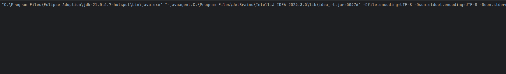
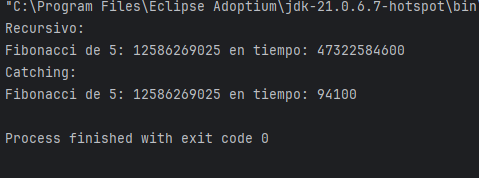

# Práctica de Búsqueda Binaria

## 📌 Información General

- **Título:** Práctica de Programacion Dinamica
- **Asignatura:** Estructura de Datos
- **Carrera:** Computación
- **Estudiante:** Brandon Fernando Rivera Zambrano
- **Fecha:** 16/07/2025
- **Profesor:** Ing. Pablo Torres

# Guía de Práctica de Laboratorio – Programacion Dinamica

## 🛠️ Descripción

---

## 🚀 Ejecución

Para ejecutar el proyecto:

1. **Compila el código:**
   ```bash
   javac App.java

## 🚀 Ejecución

Para ejecutar el proyecto:

2. **Ejecuta la aplicación:**
   ```bash
   java App

----
## 🧑‍💻 Ejemplo de Entrada

```plaintext
```
----

## 📌 Ejemplo de Salida

- Con 100
SE DEMORA FULL

- Con 50
