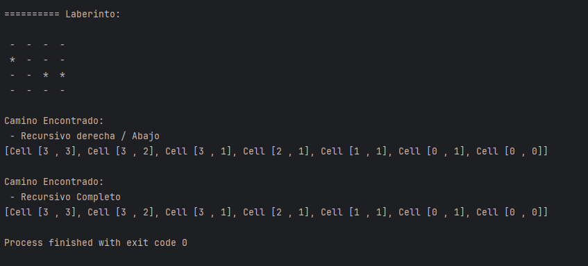

# 🧠 Práctica de Programación Dinámica

## 📘 Información General

| Campo         | Detalles                                      |
|---------------|-----------------------------------------------|
| **Título**     | Práctica de Programación Dinámica             |
| **Asignatura** | Estructura de Datos                           |
| **Carrera**    | Computación                                   |
| **Estudiante** | Brandon Fernando Rivera Zambrano              |
| **Profesor**   | Ing. Pablo Torres                             |
| **Fecha**      | 16/07/2025                                    |

---

## 🛠️ Descripción

Esta práctica de laboratorio aborda conceptos fundamentales de **programación dinámica** y **recursividad**, aplicados a la resolución de laberintos y cálculo eficiente de la secuencia de Fibonacci. Se implementa una comparación de métodos para evaluar rendimiento, además de un sistema de trazado de caminos en una matriz booleana que representa un laberinto.

---

## 🚀 Ejecución del Proyecto

1. **Compilar el código:**

```bash
   javac App.java
```

## 🚀 Ejecución

Para ejecutar el proyecto:

2. **Ejecuta la aplicación:**
   ```bash
   java App

----
## 🧑‍💻 Ejemplo de Entrada

```plaintext
```
----

## 📌 Ejemplo de Salida Fibonacci

### Con 100
- Se demora demasiado

### Con 50

## 📌 Ejemplo de Salida Laberinto

